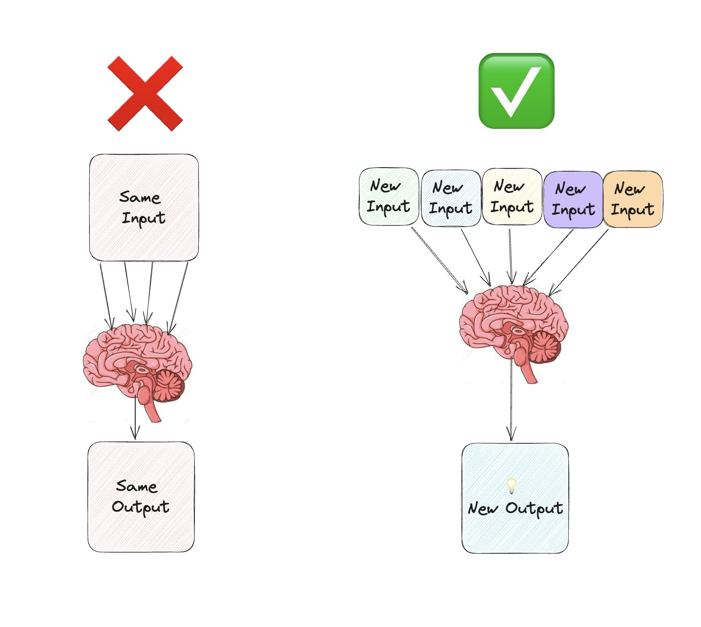

> Top executives do not feel personally responsible for coming up with strategic innovations. Rather, they feel responsible for facilitating the innovation process.

> They don’t delegate creative work. They do it themselves.

Imagine that you have an identical twin, endowed with the same brains and natural talents that you have. You’re both given one week to come up with a creative new business-venture idea. During that week, you come up with ideas alone in your room. In contrast, your twin:

1. talks with 10 people-including an engineer, a musician, a stay-at-home dad, and a designer-about the venture
2. visits three innovative start-ups to observe what they do
3. samples five “new to the market” products
4. shows a prototype he’s built to five people
5. asks the questions “What if I tried this?” and “Why do you do that?” at least 10 times each day during these networking, observing, and experimenting activities.

**Who do you bet will come up with the more innovative (and doable) idea?**

---

# 1. ⭐️ 聯想 (Associating) - 探索互不相干的新事物

Associating, the ability to connect seemingly unrelated questions, problems, or ideas from different fields, is center to the innovator’s DNA / is the backbone structure of DNA’s double helix; four patterns of action (questioning, observing, experimenting, and networking) wind around this backbone.

Associating is like a mental muscle that can grow stronger by practice. The more frequently people attempted to understand, categorize, and store new knowledge, the more easily their brains could naturally and consistently make and recombine associations.

The brain doesn’t store information like a dictionary, where you can find the word “theater” under the letter “T.” Instead, it associates the word “theater” with any number of experiences from our lives. Some of these are logical (“West End” or “intermission”), while others may be less obvious (perhaps “anxiety,” from a botched performance in high school). _The more diverse our experience and knowledge, the more connections the brain can make._ Fresh inputs trigger new associations; for some, these lead to novel ideas. As Steve Jobs has frequently observed, **“Creativity is connecting things.”**

1. [Pierre Omidyar](https://www.google.com/search?q=Pierre+Omidyar) - eBay
	1. He failed to buy shares in a hot tech company’s IPO, fueling a desire to build **fairer, more efficient markets**
	2. His fiancée wanted a hard-to-find mint tin candy box
	3. Local classified ads were terrible at matching niche buyers with sellers
2. [Steve Jobs](https://www.google.com/search?q=Steve+Jobs) - Apple
	1. **Calligraphy (鑽研書法)**
	2. **Meditation in an Indian ashram (印度教僧院打坐)**
	3. **Mercedes-Benz craftsmanship (研究賓士汽車工藝)**

# 2. 提問/質疑 (Questioning)

> “The important and difficult job is never to find the right answer, but to find the right question.” — Peter Drucker

> “My learning process has always been about disagreeing with what I’m being told and taking the opposite position, and pushing others to really justify themselves.” — Pierre Omidyar

**Question the unquestionable.**

The innovative thinkers have the capacity to hold two diametrically opposing ideas in their heads. Without panicking or simply settling for one alternative or the other, they’re able to _produce a synthesis that is superior to either opposing idea_.

Asking “Why” and “Why not” can help turbocharge the other discovery skills. Ask questions that both impose and eliminate **constraints**; this will help you see a problem or opportunity from a different angle.

# 3. 觀察 (Observing)

Discovery-driven executives produce uncommon business ideas by scrutinizing [^1] common phenomena, particularly the behavior of potential customers. **They pay attention to small details.**

Often the surprises that lead to new business ideas come from **watching other people work and live their normal lives**.

_[Genchi Genbutsu](https://www.google.com/search?q=Genchi+Genbutsu)_, Toyota’s core philosophy that translates to **“go and see for yourself.”** The best practice is to go and see the location or process where the problem exists in order to solve that problem more quickly and efficiently.

To sharpen your own observational skills, **watch how certain customers experience a product or service in their natural environment**. Spend an entire day carefully observing the “jobs” that customers are trying to get done. Try not to make judgments about what you see: Simply pretend you’re a fly on the wall, and observe as neutrally as possible. Scott Cook advises Intuit’s observers to ask, “What’s different than you expected?” Follow Richard Branson’s example and get in the habit of note taking wherever you go. Or follow Jeff Bezos’s: “I take pictures of really bad innovations.”

# 4. 實驗 (Experimenting)

 Like scientists, innovative entrepreneurs actively try out new ideas by creating prototypes and launching pilots. _The world is their laboratory._

One of the most powerful experiments innovators can engage in is _living and working overseas_. Our research revealed that the more countries a person has lived in, the more likely he or she is to leverage that experience to deliver innovative products, processes, or businesses.

To strengthen experimentation, consciously approach work and life with a **hypothesis-testing mind-set**. Attend seminars or executive education courses on topics outside your area of expertise; take apart a product or process that interests you; read books that purport [^2] to identify emerging trends.

# 5. 交流 (Networking)

Devoting time and energy to finding and testing ideas through a network of diverse individuals gives innovators a radically different perspective. Unlike most executives who network to access resources, to sell themselves or their companies, or to boost their careers, innovative entrepreneurs go out of their way to meet people with different kinds of ideas to extend their own knowledge domains. To this end, they make a conscious effort to meet people from other walks of life.

---

Why do innovators question, observe, experiment, and network more than typical executives? As we examined what motivates them, we discovered two common themes:

1. They actively desire to change the status quo
2. they regularly take risks to make that change happen

Throughout our research, we were struck by the consistency of language that innovators use to describe their motives.

* Jeff Bezos wants to _“make history,”_
* Steve Jobs to _“put a ding in the universe,”_
* Skype cofounder Niklas Zennström to “_be disruptive, but in the cause of making the world a better place.”_

In short, these innovators rely on their **courage to innovate**, steering clear of a common cognitive bias called the [status quo bias](https://www.google.com/search?q=status+quo+bias). They show an **unflinching willingness to take risks**, to transform ideas into powerful impact.

[^1]: 詳細檢查
[^2]: 聲稱、標榜
