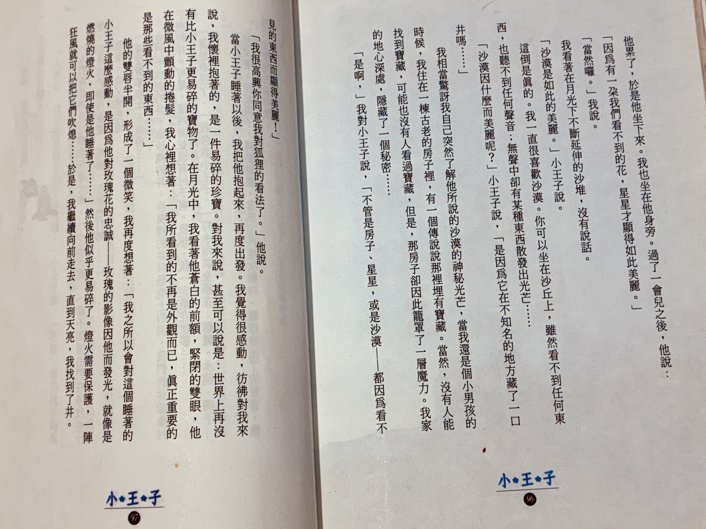
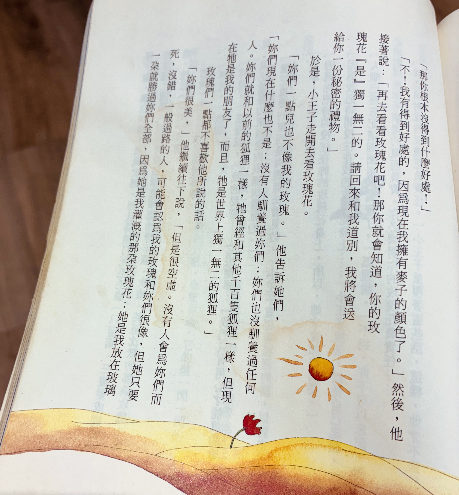
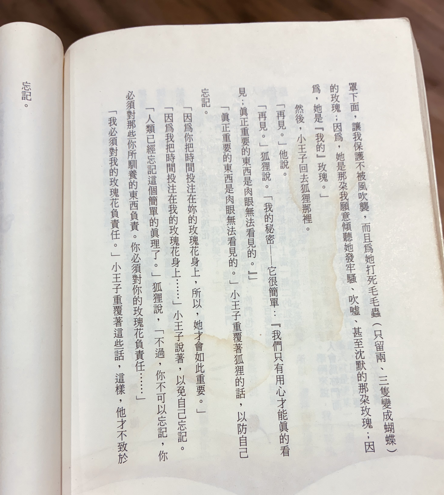

> All grown-ups were once children, but only few of them remember it.
>
> 每個人都是從小孩長大成人的，然而多數的大人卻不記得這件事。

---

> “People where you live,” the little prince said, “grow five thousand roses in one garden… yet they don’t find what they’re looking for.”
>
> “They don’t find it,” I answered.
>
> “And yet <mark>what they’re looking for could be found in a single rose, or a little water.</mark>”
>
> “Of course,” I answered.
>
> And the little prince added, “<mark>But eyes are blind. You have to look with the heart.</mark>”

---

> All men have stars, but they are not the same things for different people. For some, who are travelers, the stars are guides. For others they are no more than little lights in the sky. For others, who are scholars, they are problems. But all these stars are silent. <mark>You-You alone will have stars as no one else has them. In one of the stars I shall be living. In one of them I shall be laughing. And so it will be as if all the stars will be laughing when you look at the sky at night. You, only you, will have stars that can laugh! […] It will be as if, in place of the stars, I had given you a great number of little bells that knew how to laugh.</mark>

---

> “What makes the desert beautiful,” said the little prince, “is that somewhere it hides a well (水井)?”

> “Where are the people?” resumed the little prince at last. “It’s a little lonely in the desert…” “<mark>It is lonely when you’re among people, too,</mark>” said the snake.

---

# Chapter 21

> “I’m looking for friends. What does tamed (馴養) mean?”
>
> “It’s something that’s been too often neglected. It means, to create ties.”
>
> “To create ties?”
>
> “That’s right,” the fox said. “For me you’re only a little boy just like a hundred thousand other little boys. And I have no need of you. And you have no need of me, either. For you I’m only a fox like a hundred thousand other foxes. <mark>But if you tame me, we’ll need each other. You’ll be the only boy in the world for me. I’ll be the only fox in the world for you.</mark>”
>
> “I’m beginning to understand,” the little prince said. “There’s a flower. I think she’s tamed me.”
>
> “Possibly.” the fox said. “On Earth, one sees all kinds of things.”
>
> “Oh, this isn’t on Earth,” the little prince said.
>
> The fox seemed quite intrigued. “On another planet?”
>
> “Yes.”
>
> “Are there hunters on that planet?”
>
> “No.”
>
> “Now that’s interesting. And chickens?”
>
> “No.”
>
> “Nothing’s perfect,” sighed the fox.
>
> But he returned to his idea. “My life is monotonous. I hunt chickens; people hunt me. All chickens are just alike, and all men are just alike. So I’m rather bored. But if you tame me, my life will be filled with sunshine. I’ll know the sound of footsteps that will be different from all the rest. Other footsteps send me back underground. Yours will call me out of my burrow like music. And then, look! You see the wheat fields over there? I don’t eat bread. For me wheal is of no use whatever. Wheat fields say nothing to me. Which is sad. But you have hair the color of gold. So it will be wonderful, once you’ve tamed me! The wheat, which is golden, will remind me of you. And I’ll love the sound of the wind in the wheat.”
>
> The fox fell silent and stared at the little prince for a long while. “Please tame me!” he said.
>
> “I’d like to,” the little prince replied, “but I haven’t much time. I have friends to find and so many things to learn.”
>
> “The only things you learn are the things you tame,” said the fox. “People haven’t time to learn anything. They buy things ready-made in stores. But since there are no stores where you can buy friends, people no longer have friends. If you want a friend, tame me!”
>
> “What do I have to do?” asked the little prince.
>
> “<mark>You have to be very patient,</mark>” the fox answered. “First you’ll sit down a little ways away from me, over there, in the grass. I’ll watch you out of the corner of my eye, and you won’t say anything. <mark>Language is the source of misunderstandings.</mark> But day by day, you’ll be able to sit a little closer.”
>
> The next day the little prince returned.
>
> “It would have been better to return at the same time,” the fox said. “For instance, if you come at four in the afternoon, I’ll begin to be happy by three. The closer it gets to four, the happier I’ll feel. By four I’ll be all excited and worried; I’ll discover what it costs to be happy! But if you come at any old time, I’ll never know when I should prepare my heart.” <mark>There must be rites (儀式).</mark>”
>
> “What’s a rite?” asked the little prince.
>
> “That’s another thing that’s been too often neglected,” said the fox. “It’s the fact that one day is different from the other days, one hour from the other hours. My hunters, for example, have a rite. They dance with the village girls on Thursdays.
>
> “So Thursday’s a wonderful day: I can take a stroll all the way to the vineyards. If the hunters danced whenever they chose, the days would all be just alike, and I’d have no holiday at all.”
>
> That was how the little prince tamed the fox. And when the time to leave was near:
>
> “Ah!” the fox said. “I shall weep.”
>
> “It’s your own fault,” the little prince said. “I never wanted to do you any harm, but you insisted that I tame you.”
>
> “Yes, of course,” the fox said.
>
> “But you’re going to weep!” said the little prince. “Yes, of course,” the fox said.
>
> “Then you get nothing out of it?”
>
> “I get something,” the fox said, “because of the color of the wheat.” Then he added, “Go look at the roses again. You’ll understand that yours is the only rose in all the world. Then come back to say good-bye, and I’ll make you the gift of a secret.”
>
> The little prince went to look at the roses again.
>
> <mark>“You’re not at all like my rose. You’re nothing at all yet,” he told them. “No one has tamed you and you haven’t tamed anyone. You’re the way my fox was. He was just a fox like a hundred thousand others. But I’ve made him my friend, and now he’s the only fox in all the world.”</mark>
>
> And the roses were humbled.
>
> <mark>“You are lovely, but you’re empty,” he went on. “One couldn’t die for you. Of course, an ordinary passerby would think my rose looked just like you. But my rose, all on her own, is more important than all of you together, since she’s the one I’ve watered. Since she’s the one I put under glass. Since she’s the one I sheltered behind a screen. Since she’s the one for whom I killed the caterpillars (except the two or three for butterflies). Since she’s the one I listened to when she complained, or when she boasted, or even sometimes when she said nothing at all. Since she’s my rose.”</mark>
>
> And he went back to the fox.
>
> “Good-bye,” he said.
>
> “Good-bye,” said the fox. “Here is my secret. It’s quite simple: <mark>One sees clearly only with the heart. Anything essential is invisible to the eyes.</mark>” [^1]
>
> “Anything essential is invisible to the eyes,” the little prince repeated, in order to remember.
>
> “<mark>It’s the time you spent on your rose that makes your rose so important.</mark>”
>
> “It’s the time I spent on my rose…” the little prince repeated, in order to remember.
>
> <mark>“People have forgotten this truth,” the fox said. “But you mustn’t forget it. You become responsible forever for what you’ve tamed. You’re responsible for your rose.”</mark>

[^1]: _[“The best and most beautiful things in the world cannot be seen or even touched - they must be felt with the heart.” — Helen Keller](http://brainyquote.com/quotes/helen_keller_101301)_
