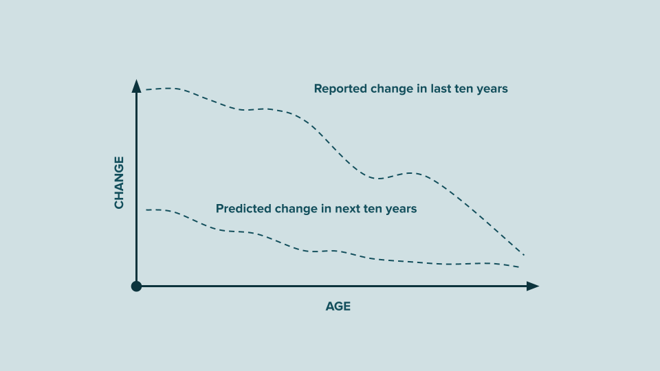

# [The End of History’Illusion](https://doi.org/10.1126/science.1229294)

The study by psychologists [Daniel Gilbert](https://www.google.com/search?q=Daniel+Gilbert) and [Timothy Wilson](https://www.google.com/search?q=Timothy+Wilson) have shown that people consistently mispredict their future emotional states. They underestimate how much they will change in the future, despite knowing how much they have changed over time.

---

Human beings are works in progress that mistakenly think they’re finished.

We somehow imagine that the person we are right now is the person we’ll be for the rest of time. (Hint: This is not the case!)

The person you are right now is as transient, as fleeting, and as temporary as all the people you’ve ever been.

The only constant in life is change.
