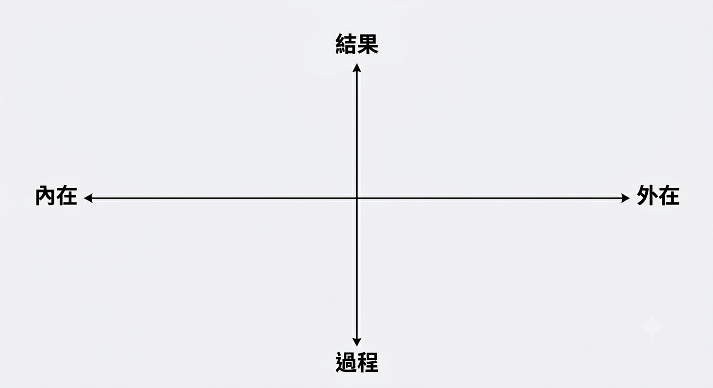

# AI 任務矩陣

瓦基為了避免陷入 AI 的「討好陷阱」，設計了一套對話的二維矩陣框架。這能幫助我們在對話前，先釐清自己的**出發點（意圖）**，進而擺出正確的**對話姿態**。

## 兩個軸度

* **X 軸（資訊來源）**：區分為「內在」（個人感受、觀點、情緒）與「外在」（職場知識、客觀資料、收集來的資訊）。
* **Y 軸（預期目標）**：區分為追求「結果」（具體產出，如文章、企劃案、簡報）與享受「過程」（內在對話、挖掘、反思體驗）。

## 四個象限

1. **內在 ＋ 過程（傾聽者、心理陪伴）
	* **情境**：情緒低潮、需要被理解、分析內心焦慮、或是進行卡片盒筆記的內在反思。
	* **對話姿態**：在這個象限，你需要 AI **站在你這邊，甚至容許它的討好與偏見**。你希望它提供情感支持、陪伴與拍拍，出發點是梳理與安頓自己的內心。
2. **外在 ＋ 結果（嚴格顧問、紅隊演練、批判性黑臉）**
	* **情境**：做商業決策、規劃行銷策略、分析客觀數據、製作對外說服的簡報。
	* **對話姿態**：這時必須**極力避免 AI 的討好偏見**。你的出發點是得到精準、客觀且禁得起考驗的產出。你應該要求 AI 扮演「嚴格的黑臉顧問」或「反方立場」，大力挑出你邏輯的盲點與漏洞。
3. **內在 ＋ 結果（個人寫作教練）**
	* **情境**：把個人的獨特觀點、讀書心得，轉化為一篇可以公開發表的文章。
	* **對話姿態**：出發點是將混亂的內在思緒結構化。對話時應將 AI 定位為「編輯」或「導師」，引導自己把獨特的人性觀點漂亮地表達出來，而不是讓 AI 替你無中生有。
4. **外在 ＋ 過程（共學夥伴、蘇格拉底式引導者）**
	* **情境**：學習一門全新的硬核知識、理解複雜的職場法規。
	* **對話姿態**：不急著要答案，而是享受理解的過程。此時出發點是知識的內化，你可以讓 AI 扮演引導者，用問答的方式陪你釐清盲點。

# 自己是最大的瓶頸（The Human Bottleneck）

在沒有 AI 之前，人們常會因為「我不會排版」、「我不知道怎麼分類」、「我沒時間整理資料」而卡在原地。但現在有了強大的大語言模型，技術與執行上的摩擦力已經被降到趨近於零，只要透過對話，專案進度就能被直接展開並推進。 這意味著：**所有的瓶頸（Bottleneck）最終都回歸到人類自己身上 — 那就是「你的認知能力」與「你知不知道自己要什麼」**

# 工作的目的：從「追求生產力」轉向「追求幸福」

* **翻轉盲目追求產出的焦慮**：訪談中提到，人們過去常常陷入對生產力的盲目追求與焦慮中。但在 AI 時代，我們應該將焦點從純粹的「生產力」，轉向追求內心的「幸福」。
* **以快樂驅動自我實現**：工作與優化流程的本質，演變為思考「如何讓快樂的事情，協助我們達成自我實現」。

# 拿 AI 釋放出來的時間做什麼？經營「人與人的連結」

當 AI 幫我們縮短了寫作、分類、排版與處理 [庶務](https://www.google.com/search?q=庶務)（雜事）的時間後，人類平白多出了許多時間與心智頻寬。這些被工具「省下來」的資源，不該拿來塞入更多工作，而是該投資在最珍貴的地方：

* **深化最不可取代的「人的關係」**：在 AI 密集的年代，「人的關係」反而變得無比重要。無論是工作夥伴（如瓦基與妹妹）、朋友，還是生命中最重要的家人，人與人之間的真摯情感是 AI 無法重現的。
* **利用工具創造生命中的「餘裕」**：善用 AI（例如<mark>用語音輸入降低寫作摩擦力</mark>）可以大幅省下力氣。

# 你是誰？你想要什麼？

當 AI 解決了所有底層的執行阻礙，人類省下了大量的時間，就必須面對最核心的哲學問題：

> Remember who you are and what you want.
>
> 記住你是誰，以及你想要什麼。

**AI 是一對翅膀，它沒有主體意識，端看你要把它裝在身體哪個部位？要飛去哪裡？工具永遠只是手段，如果沒有清晰的自我認知與目標，再強大的工具也只是在幫你 _ 加速 _ 迷失而已。**
